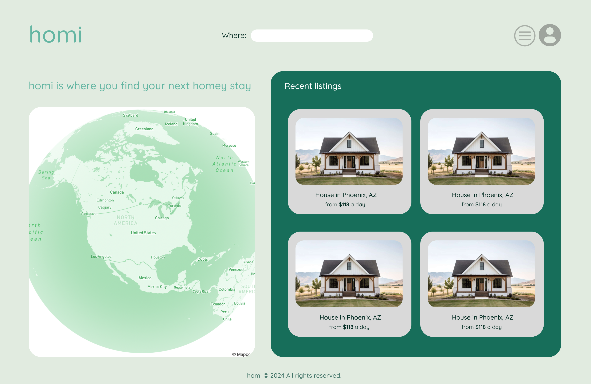
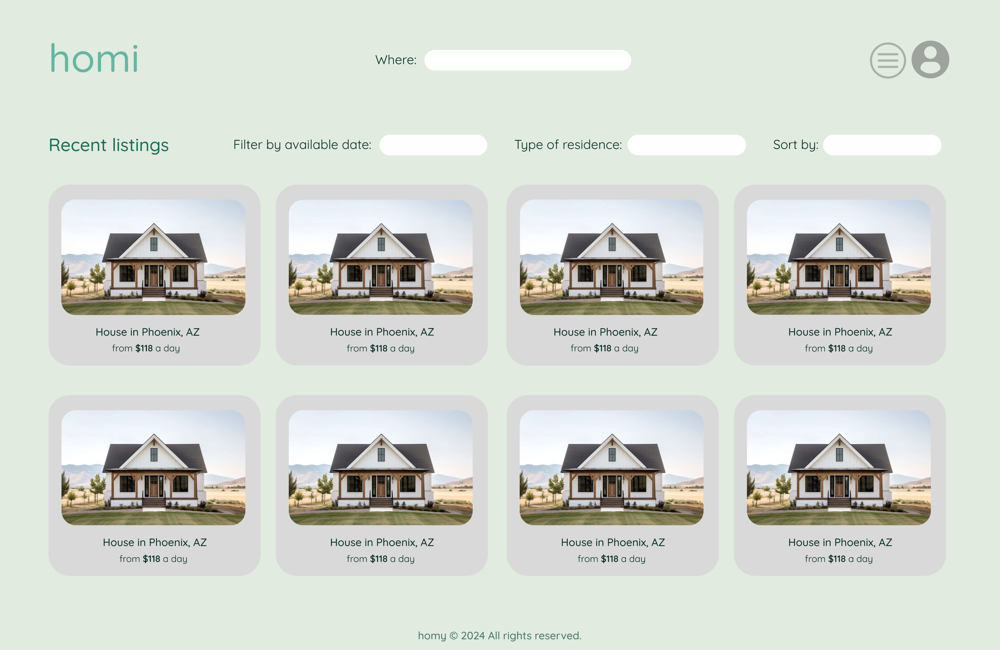
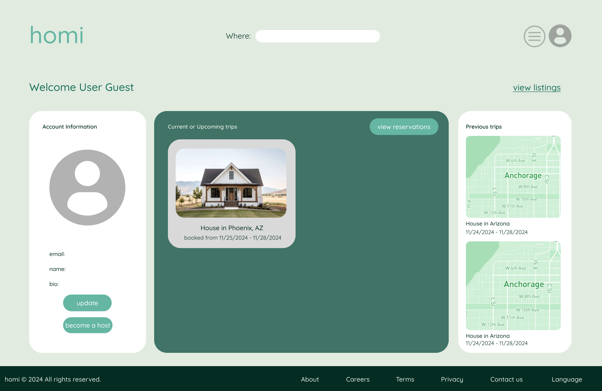
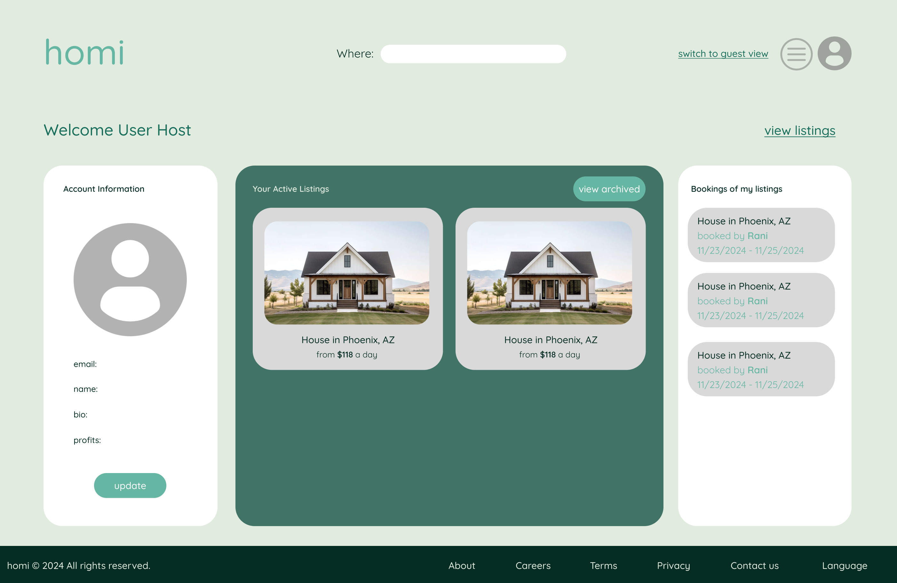
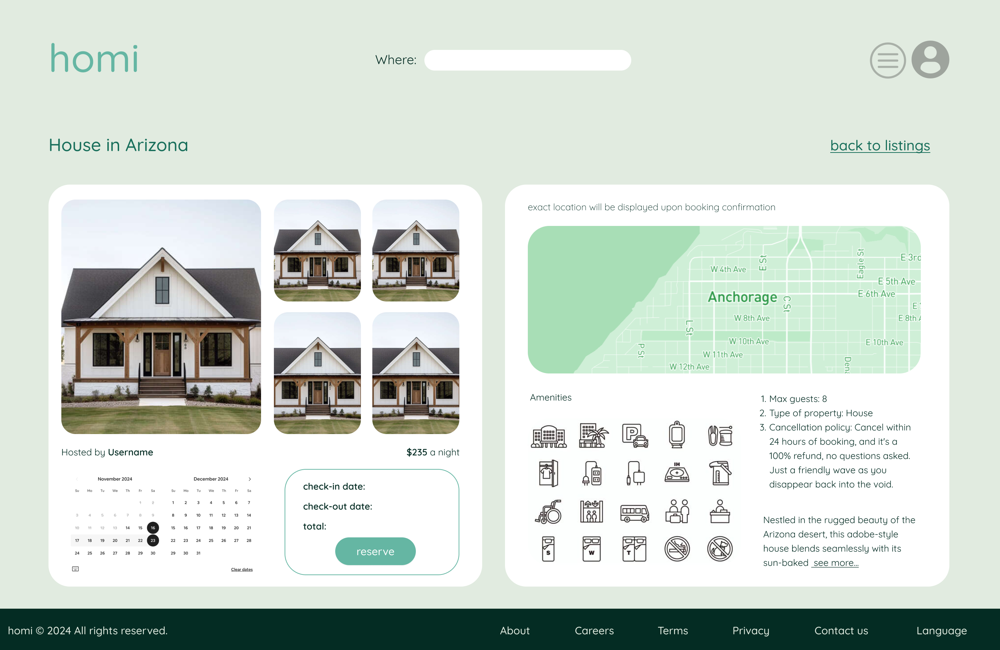
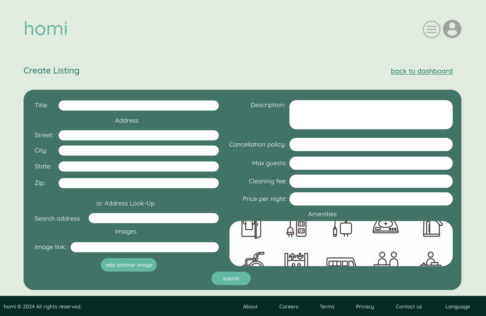
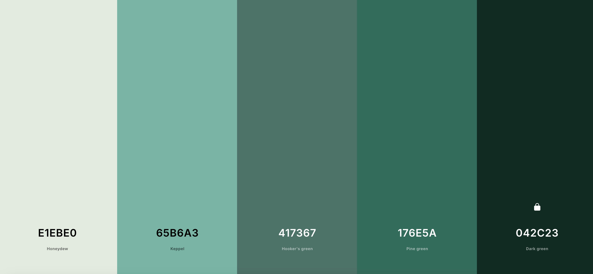
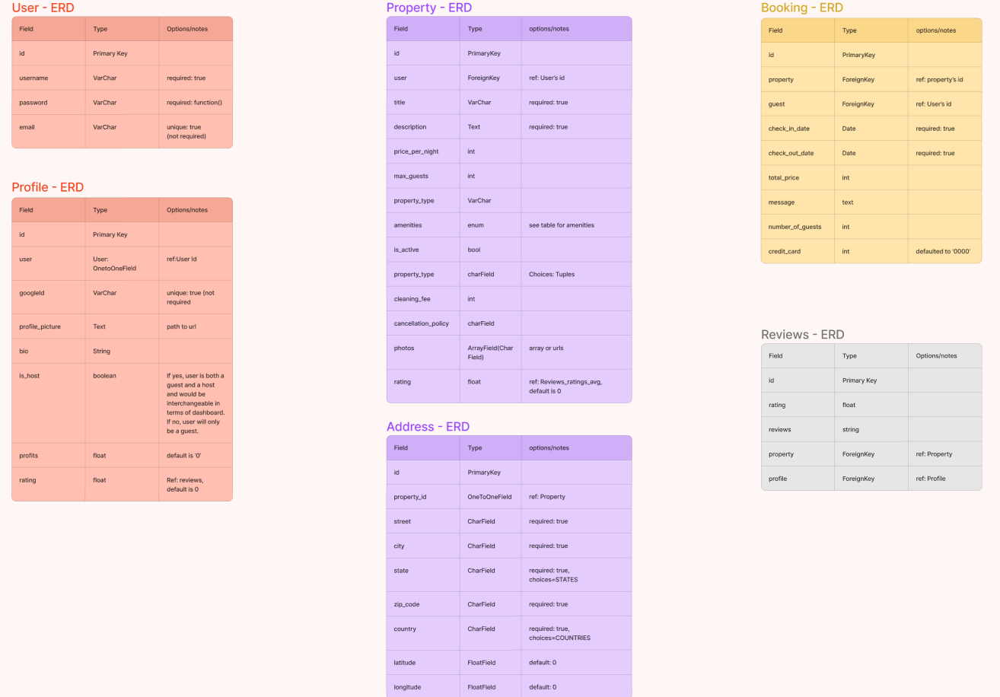
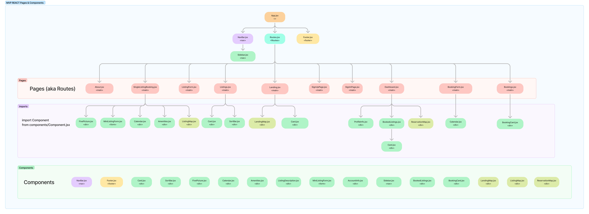

# Welcome to homi
## homi is where you find your next homey stay

* check out **homi** front-end [here](https://github.com/mdeadwiler/homi-front-end).
* check out **homi** back-end [here](https://github.com/realpolya/homi-back-end).

### Planning

#### User Stories

* (Guest)AAU I want to be able to see a landing page showing me a list of available rentals before or after signing in
* (Guest)AAU I want to be able to search for available rentals in a specific area before or after signing in
* (Guest)AAU, I want to sign up for an account and sign in, so that I can access my user profile and book rentals
* (Host)AAU, I want to sign up for an account and sign in, so that I can access my user profile and list rentals 
* (Host)AAU I want to be able to toggle my account between one solely looking to rent and one looking to list rentals
* (Guest)AAU, I should see a nav bar with links at the top of each page in the application
* (Guest)AAU, clicking on the ‘Home’ link should navigate me to a landing page where I can see properties being listed
* (Guest)AAU,  I  want to have the option to sign out in whichever page I'm in
* (Host)AAU, If I am renting out properties, I want to be able to view all of my listings from my profile page
* (Host)AAU, if I am renting out properties I want to be able to check on the status of individual properties I have listed
* (Guest)AAU, I want to be able to enter my credit card information to pay for a rental
* (Host)AAU, I want to be able to receive payment for my properties if I am a host
* (Guest)AAU, I want to be able to see the amenities available at a listing
* (Guest)AAU, I want to search for a listing based on the type of property it is(ie apartment, cabin, beach house, etc)
* (Guest)AAU, I want to be able to search no matter what page I'm on
* (Guest)AAU, I should be able to see the sort bar when looking for properties
* (Guest)AAU, I should see a footer on the site no matter what page I'm on
* (Guest)AAU, I should see a map displayed on the landing page alongside listings
* (Guest)AAU, I should see a map on the listing description displaying an approximate location of the property
* (Guest)AAU, I should see a map on the listing description displaying an approximate location of the property
* (Guest)AAU, when I book a listing I should see exactly where it is on the map and receive the address
* (Guest)AAU, I should be be able to see a list of my upcoming rentals on my dashboard
* (Guest)AAU, I should be able to edit my user profile
* (Host)AAU, I should be able to see a feed that displays information about my properties being rented on my dashboard 
* (Guest)AAU, I should be able to see on a calendar what dates a listing is or isn't available
* (Guest)AAU, I should be able to select the dates I want to rent a property for
* (Host)AAU, I should be able to create a listing for a property I want to rent out
* (Host)AAU, I should be able to designate a maximum number of guests that can stay at my property
* (Host)AAU, I should be able to add what amenities are available at my property
* (Guest)AAU, I should be able to see photos of the property when looking for a property to rent

### Landing Page

### Listings Page

### Guest Dashboard Page

### Host Dashboard Page

### Single Listing Page

### Create Listing Page

### Color Palette

### ERD
ERD was made in Figma

### React Components

### Technolgoies we used

* Node.js
* Express
* HTML
* CSS
* JavaScript
* React
* Django
* Python

### Routes
.png)

### Post MVP Goals
* Google Maps Autocomplete API for searches
* React Native APP
* Email and SMS notifications after account creation, log in, confirmed payment, and confirmed booking
* Add star rating component
* Use stripe for payment
* Be able to block off dates a property isn't available for rental

### Sources
Uplash - stock photos